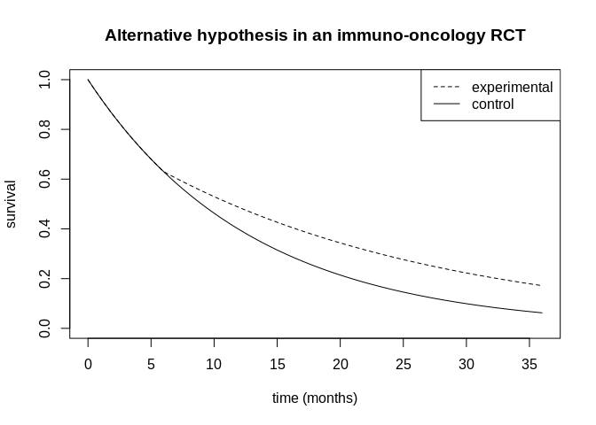

<!-- README.md is generated from README.Rmd. Please edit that file -->

# gsdelayed

<!-- badges: start -->
<!-- badges: end -->

The goal of gsdelayed is to help with designing a randomized controlled
trial, where the endpoint is time-to-event, and a delayed treatment
effect is anticipated. [Modestly-weighted log-rank
statistics](https://onlinelibrary.wiley.com/doi/full/10.1002/sim.8186)
are used, which includes the standard log-rank statistic as a special
case. Single-stage, two-stage and three-stage designs are accommodated,
where the default is to use a Lan-DeMets O’Brien-Fleming alpha-spending
function. But the user is free to specify any alpha-spending function
they wish. Operating characteristics are calculated via numerical
integration (for speed). However simulation functions are also provided
that can be used to double-check the chosen design.

## Installation

You can install the development version from
[GitHub](https://github.com/) with:

``` r
# install.packages("devtools")
devtools::install_github("dominicmagirr/gsdelayed")
library(gsdelayed)
```

## Example

Suppose we are designing a RCT where we expect a delayed treatment
effect on survival. For example, our alternative hypothesis might look
like this:

``` r
t_seq <- seq(0,36, length.out = 100)
s_c <- purrr::map_dbl(t_seq, surv_pieces_simple, change_points = c(6), lambdas = log(2) / c(9, 9))
s_e <- purrr::map_dbl(t_seq, surv_pieces_simple, change_points = c(6), lambdas = log(2) / c(9, 16))

plot(t_seq, s_c, ylim = c(0,1), type = "l", 
     xlab = "time (months)", ylab = "survival",
     main = "Alternative hypothesis in an immuno-oncology RCT")
points(t_seq, s_e, lty = 2, type = "l")
legend("topright", c("experimental", "control"), lty = 2:1)
```



Suppose we are able to recruit 225 patients to each arm (with a uniform
recruitment rate) over a 12 month period, and we intend to analyse the
data after 30 months from the start of the trial. What is the power,
assuming we use a standard log-rank test?

``` r
model <- list(change_points = c(6),
             lambdas_0 = c(log(2) / 9, log(2) / 9),
             lambdas_1 = c(log(2) / 9, log(2) / 16))

recruitment <- list(n_0 = 225, n_1 = 225, r_period = 12, k = 1)


## Standard log-rank test (t* = 0)
single_stage_design(t_star = 0,
                    model = model,
                    recruitment = recruitment,
                    dco_final = 30,
                    alpha_one_sided = 0.025)[c("overall_power", "n_events")]
#> $overall_power
#> [1] 0.7978047
#> 
#> $n_events
#> [1] 347.5672
```

Answer: about 80%. And we expect to observe around 350 events. Given
that we anticipate a delayed effect, we can increase power by using a
[modestly-weighted log-rank
test](https://onlinelibrary.wiley.com/doi/full/10.1002/sim.8186). If we
choose the parameter

equal to 12, we are effectively doing an average landmark analysis from
time 12 months until the end of the study (as is discussed
[here](https://arxiv.org/abs/2007.04767)).

``` r
# Modestly-weighted log-rank test (t* = 12)
single_stage_design(t_star = 12,
                    model = model,
                    recruitment = recruitment,
                    dco_final = 30,
                    alpha_one_sided = 0.025)[c("overall_power", "n_events")]
#> $overall_power
#> [1] 0.9155788
#> 
#> $n_events
#> [1] 347.5672
```

## 2-stage designs

Now suppose we want to add an interim analysis after 18 months. We need
to choose how much alpha to spend at the interim. By default the package
uses a Lan-DeMets O’Brien-Fleming spending function, and that is what
we’ll use in this example. Firstly, for the standard log-rank test…

``` r
## Standard log-rank test (t* = 0)
two_stage_design(t_star = 0,
                 model = model,
                 recruitment = recruitment,
                 dco_int = 18,
                 dco_final = 30,
                 alpha_spend_f = ldobf,
                 alpha_one_sided = 0.025)[c("critical_values",
                                            "p_early_stop",
                                            "overall_power",
                                            "expected_t")]
#> $critical_values
#> [1] -2.416430 -2.002319
#> 
#> $p_early_stop
#> under_alternative under_null_approx 
#>       0.172645039       0.007836775 
#> 
#> $overall_power
#> [1] 0.785722
#> 
#> $expected_t
#> under_alternative under_null_approx 
#>          27.92826          29.90596
```

…and then for the modestly-weighted test (t\*=12)…

``` r
# Modestly-weighted log-rank test (t* = 12)
two_stage_design(t_star = 12,
                 model = model,
                 recruitment = recruitment,
                 dco_int = 18,
                 dco_final = 30,
                 alpha_spend_f = ldobf,
                 alpha_one_sided = 0.025)[c("critical_values",
                                            "p_early_stop",
                                            "overall_power",
                                            "expected_t")]
#> $critical_values
#> [1] -2.851657 -1.972153
#> 
#> $p_early_stop
#> under_alternative under_null_approx 
#>       0.164187496       0.002174603 
#> 
#> $overall_power
#> [1] 0.9137339
#> 
#> $expected_t
#> under_alternative under_null_approx 
#>          28.02975          29.97390
```

## 3-stage designs

We can also extend to three stages. For example, adding another interim
analysis at month 24. Firstly, for the standard log-rank test…

``` r
## Standard log-rank test (t* = 0)
three_stage_design(t_star = 0,
                   model = model,
                   recruitment = recruitment,
                   dco_int_1 = 18,
                   dco_int_2 = 24,
                   dco_final = 30,
                   alpha_spend_f = ldobf,
                   alpha_one_sided = 0.025)[c("critical_values",
                                              "p_first_int_stop",
                                              "p_second_int_stop",
                                              "overall_power",
                                              "expected_t")]
#> $critical_values
#> [1] -2.416430 -2.178552 -2.058785
#> 
#> $p_first_int_stop
#> under_alternative under_null_approx 
#>       0.172645039       0.007836775 
#> 
#> $p_second_int_stop
#> under_alternative under_null_approx 
#>       0.376275120       0.009155558 
#> 
#> $overall_power
#> [1] 0.7709122
#> 
#> $expected_t
#> under_alternative under_null_approx 
#>          25.67061          29.85103
```

…and then for the modestly-weighted test (t\*=12)…

``` r
# Modestly-weighted log-rank test (t* = 12)
three_stage_design(t_star = 12,
                   model = model,
                   recruitment = recruitment,
                   dco_int_1 = 18,
                   dco_int_2 = 24,
                   dco_final = 30,
                   alpha_spend_f = ldobf,
                   alpha_one_sided = 0.025)[c("critical_values",
                                              "p_first_int_stop",
                                              "p_second_int_stop",
                                              "overall_power",
                                              "expected_t")]
#> $critical_values
#> [1] -2.851657 -2.267360 -2.031482
#> 
#> $p_first_int_stop
#> under_alternative under_null_approx 
#>       0.164187496       0.002174603 
#> 
#> $p_second_int_stop
#> under_alternative under_null_approx 
#>        0.54233564        0.01019864 
#> 
#> $overall_power
#> [1] 0.9063206
#> 
#> $expected_t
#> under_alternative under_null_approx 
#>          24.77574          29.91271
```
